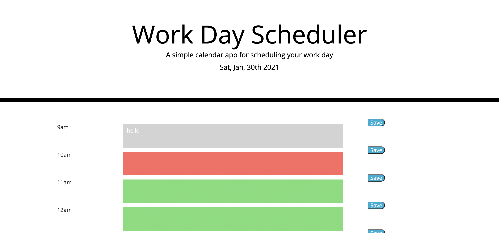

# Work Day Planner
## This homework assignment was to make a dynamic work day planner that would not only show the current time/day and change the background styling depending on time of day, but also save the user input to local storage.

 